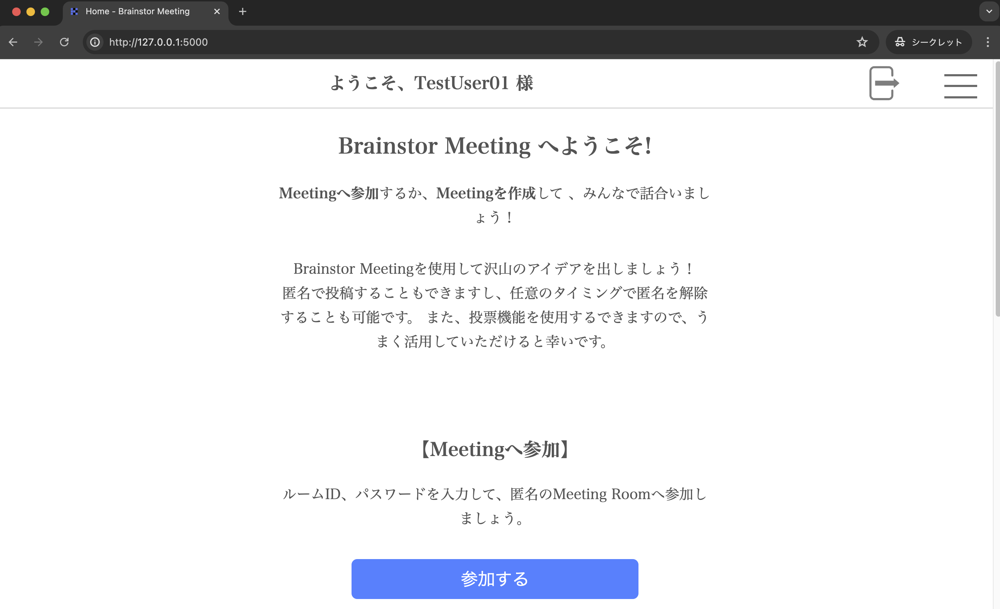

# Flask_brainstor_meeting_Webapp

初めてFlaskを用いたWebアプリの開発を行いました。
以下のファイル構成、システム構成図、コマンド、実行画像などを示したいと思います。

プログラムは、勉強も兼ねて作成したので拙い部分もいくつかあると思います。


### 概要
作成したものは、チーム内で利用できる匿名掲示板です。
名前は、**Brainstor Meeting**です。

作成した背景は、以下の通りです。
- Flaskを利用して何かアウトプットを作成したいと考えたため
- ウェブアプリのセキュリティを勉強したいと考えたため
- グループで意見を出し合っている際に、もっと匿名であればもっと気がるに意見を出し合えるのではないかと考えたため

上記の理由により、チーム内だけで利用できる意見を出し合うためのチ掲示板、Brainstor Meetingを作成しました。

また、当コードはPaaSのサービスを用いで一時的に公開し、正しく動作することを確認しました。

### ファイル構成
```
brainstor_meeting
├── project/
│   ├── static/
│   │   ├── img/
│   │   │   ├── icon.png
│   │   │   ├── logout.png
│   │   │   └── user.png
│   │   ├── sc/
│   │   ├── main.js
│   │   └── style.css
│   ├── templates/
│   │   ├── auth/
│   │   │   ├── login.html
│   │   │   ├── register.html
│   │   │   └── auth.html
│   │   ├── user/
│   │   │   ├── delete.html
│   │   │   ├── nickname.html
│   │   │   ├── password.html
│   │   │   ├── login.html
│   │   │   ├── register.html
│   │   │   └── user.html
│   │   ├── meeting/
│   │   │   ├── brainstorm/
│   │   │   │   ├── meeting.html
│   │   │   │   └── post.html
│   │   │   ├── update.html
│   │   │   ├── auth.html
│   │   │   └── index.html
│   │   ├── room/
│   │   │   ├── create.html
│   │   │   ├── delete.html
│   │   │   └── update.html
│   │   └── base.html
│   ├── __init__.py
│   ├── auth.py
│   ├── db.py
│   ├── functions.py
│   ├── meeting.py
│   ├── room.py
│   └── schema.sql
└── .venv/
    ├── ...
    └── ...
```
### 機能概要
機能は以下の通りです。
- ミーティング機能(参加認証、投稿、投稿編集、投稿投票、投稿削除など)
- アカウント機能(新規登録、ログイン、情報の変更、削除など)
- ルーム管理機能(ルーム作成、ルーム編集、ルーム参加認証など)


### コマンド
ローカルで実行するためのコマンド（MacBookの場合）
```
$ mkdir brainstor_meeting
$ cd brainstor_meeting
brainstor_meeting　$ python -m venv venv
brainstor_meeting　$ source venv/bin/activate
brainstor_meeting　$ pip install Flask
brainstor_meeting　$ mkdir project
brainstor_meeting　$ cd project
brainstor_meeting　$ git clone https://github.com/KS-PF/Flask_brainstor_meeting_Webapp.git
brainstor_meeting　$ cd ../
brainstor_meeting　$ flask --app project init-db
brainstor_meeting　$ flask --app project run --debug
```
SECRET_KEYの生成
```
$ python3 -c 'import secrets; print(secrets.token_hex())'
```

仮想環境の終了
```
$ deactivate
```

### イメージ画像

#### アカウント作成


#### ログイン


#### ホーム画面



#### ミーティング作成


#### 作成したミーティングの表示


#### アカウント機能一式


#### アカウントページ


####  ミーティング機能


####  投票機能


### 注意事項
sc/ファイルの画像はアップロードしていません。ローカルで実行するときは、文字に応じた画像を入れてください。